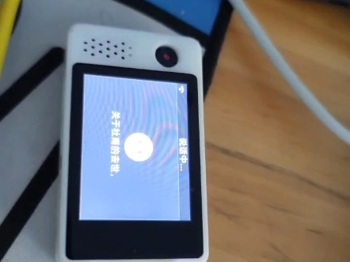
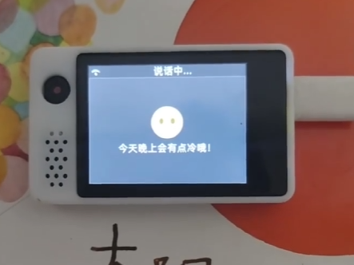

# xiaozhi-esp32-server-mini

适配[Xiaozhi](https://github.com/78/xiaozhi-esp32?tab=readme-ov-file)的AI agent服务器程序

## 目标

本服务端致力于能跑到`NAS`, `路由器`, `树莓派`等轻量级设备，因此所有大模型均调用API服务

## 现状

使用[Xiaozhi](https://github.com/78/xiaozhi-esp32)来进行对话。

没有联网能力

## 运行时内存

- 对话时大概76M
- 非对话时大概36M常驻内存

## 记忆

- 支持会话记忆(即本次唤醒后所有的对话聊天，暂未实现压缩)
- 历史对话记录(即历史对话记录摘要，用于每次对话时记忆召回)
- 用户画像（每次会话结束之后，会更新用户话像，方便AI做出更适合用户的回答)

## 意图识别

- 每次唤醒之后，会根据用户输入，调用大模型来进行意图识别，之后本次会话的所有对话都由意图识别给出的`Agent`来应答

## Agent

- `闲聊`默认全能型提示词
- `小学全科老师`用于解决小朋友们的一些学习上的问题

## 部署方式

- Docker部署，镜像大概80M

- [详细方式](docs/Deploy.md)

## 前端(两个，分别是网页端和语音端)

- 一个Web前端用于调试`AI Agent`相关的功能和OTA接口
- [Xiaozhi](https://github.com/78/xiaozhi-esp32?tab=readme-ov-file)语音终端

## 当前使用的一些组件

- `SileroVad` 用来提前去除一些非人类声音, 降低`ASR`的开销
- `ASR` 使用了腾讯提供的服务，每个月`5000`次的免费额度足够了
- `TTS` 使用了`EdgeTTS`服务，支持流式，目前是通过标点切分来实现流式输入，`EdgeTTS`自带流式输出。
- `Embedding` 使用了`硅基流动`提供的免费API, 虽然有并发限制，在只有一个设备的情况下，并发也够了
- `大模型` 分别使用了`智谱AI`和`硅基流动`提供的免费API, 同时使用可解决并发问题
- `向量数据库` 使用了[Redis-Stack](https://redis.io/about/about-stack)提供的免费数据库，免费的32M内存目前应该也足够做记忆召回了
## 配置文件

[配置文件](./backend/conf.lua), 里面包含了所有的配置信息，包括`ASR`, `TTS`, `Embedding`, `大模型`, `向量数据库`等

## TODO

- 优化记忆召回
- 抽象简易`Workflow`, 方便编写一些稍微复杂一点的`AI Agent`
- 基础知识库召回(主要是一些儿童读物，课本，防止大模型的幻觉让小朋友学到错误的知识)
- HomeAssistant对接
- 接入喜马拉雅讲故事
